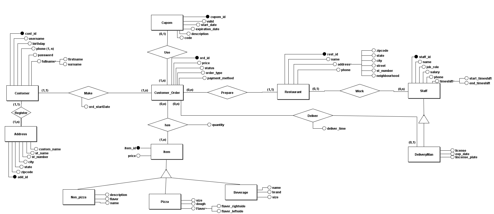
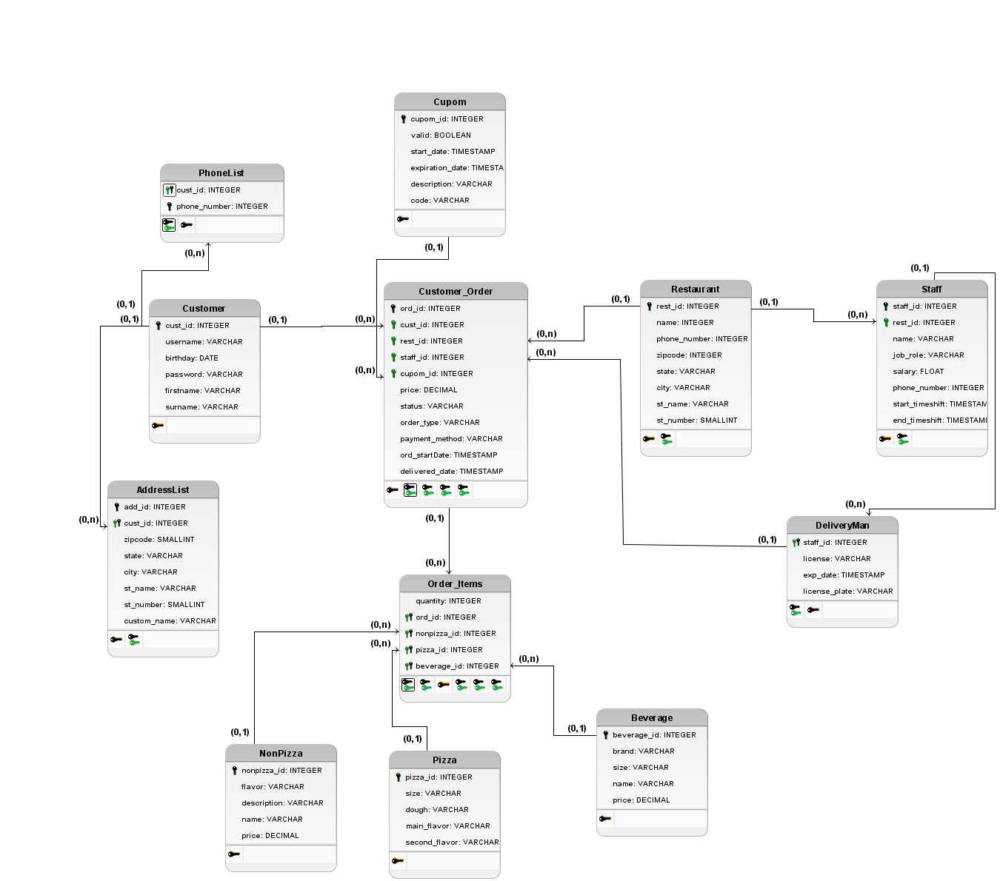

# DominosDatabaseProject

### Project Description :
Dominos is a big pizza franchise that has a lot of restaurants in the world. In this project I am going to create a relational database in Postgresql that simulates the current state of dominos website and how it possibly works inside brazil.

### Project objective : 
Prove SQL administration knowledge :
 * Database Thinking 
 * Database Design (ER -> tableSchema -> SQL)
 * Database Creation
 * User-Role Management
 * Schema Creation
 * Views Creation
 * Triggers and Procedures
 * Backups

### Dominos website contents :
* Dominos has Coupons (Only one can be used byorder)
* Dominos has a lot of restaurants in brazil and alot of employees
* Dominos a small menus with four types of food(Pizzas, Sandwiches, Desserts and Beverages)
* Dominos has a login system that allow customersto create users with their personal information
* Dominos allow users to register multiple creditcards and addresses.

### The flow of ordering a pizza inside dominos website.
1) Customers open dominos' website and click on“Start Order”.
2) Choose order type : Delivery or Carryout.
3) Customer Login / Register in account.
4) Create account with personal information:  
    A) Firstname, Surname, Birthday and phonenumber  
    B) Register address with personalized name zipcode, state, street, number andaditional_information.  
    C) Register payment methods.
5) Pick menu items (choose Pizza)  
    A) pick main flavor (Pizza can have 2 flavors)  
    B) pick dough and size.  
6) Choose address and payment method
7) Wait for the pizza to be delivered by the pizzadelivery man.

### Additional information :
* Dominos has many restaurants distributed in brazil each with their information. Such as phone number, address,opening time and staff.
* Each domino's restaurant has its own staff with their information.
* Some employees work as pizza delivery men and deliver pizzas.

### Entity–Relationship Diagram :

### Resulting Table Schema :

### SQL

1) Create Database and the tables corresponding to the Table Schema
2) insert data into database
3) create users / role examples 
4) Views / Materialized Views
